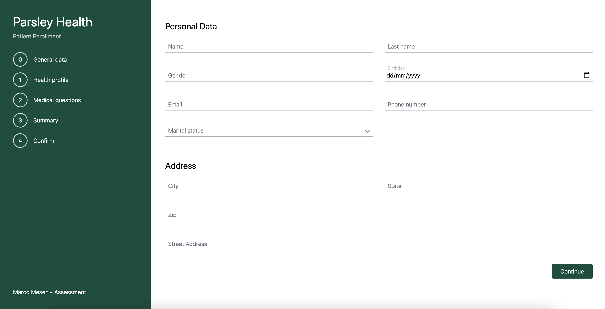
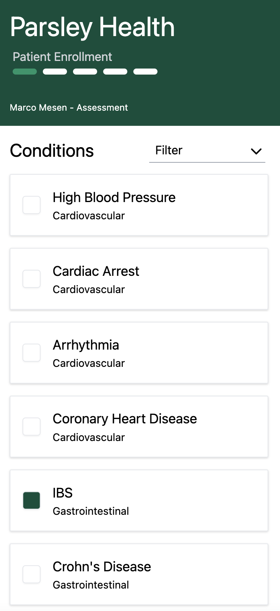

# Patient Enrollment Form

Developed by Marco Mesén - [marcomesen.com](https://marcomesen.com)
For Parsley Health

## Image Demo - Full Screen



## Image Demo - Responsive (Mobile)



## Technologies used

- [React](https://reactjs.org/)
- [NextJS](https://nextjs.org/docs)
- [Hooks](https://es.reactjs.org/docs/hooks-intro.html)
- [Typescript](https://www.typescriptlang.org/)
- [Tailwind](https://tailwindcss.com/)

## Architecture

The project was developed with Flux Architecture for State Managment - Based on this article: [marcomesen.com/blog](https://marcomesen.com/blog/state-handling-in-react-with-flux-architecture-using-usecontext-and-usereducer-hook)

```
-src
---app                ~ General project files, such as 'Typescript' types.
---components         ~ Components for app.
---hooks              ~ Custom hooks mades.
---pages              ~ Sreens for each route.
---state              ~ All the logic for State Managment.
---styles             ~ Custom CSS and initial config to Tailwind
```

## Getting Started

1. run `yarn install`
2. run `yarn start`

Open [http://localhost:3000](http://localhost:3000) with your browser to see the result.

## Learn More

This is a [Next.js](https://nextjs.org/) project bootstrapped with [`create-next-app`](https://github.com/vercel/next.js/tree/canary/packages/create-next-app).

To learn more about Next.js, take a look at the following resources:

- [Next.js Documentation]() - learn about Next.js features and API.
- [Learn Next.js](https://nextjs.org/learn) - an interactive Next.js tutorial.
